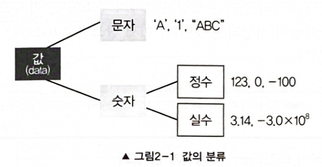

# 변수의 타입

Type은 크게 **문자와 숫자**로 나눌 수 있다. 또 숫자는 **정수와 실수**로 나눌 수 있다.



이 값의 Type에 따라 값에 따라 적절한 공간의 크기와 저장형식을 정의한 것이 date type이다.</br>
date type에는 문자형, 정수형, 실수형 등이 있다.

### 기본형과 참조형
자료형은 크게 **'기본형'**과 **'참조형'** 두가지로 나뉜다. **기본형 변수는 실제 data를 저장**하는 반면, **참조형 변수는** 어떤 값이 저장되어 있는 memory address를 값으로 갖는다.

> 자바에서는 기본형 변수만 연산에 쓰인다.

다음은 참조변수를 선언하는 방법이다.
```java
Data today = new Date(); // Date클래스 타입의 참조변수 today를 선언한 것.
```
---
## 1.기본형(primitive type)
