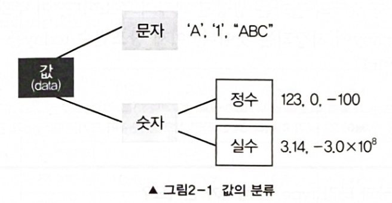

# 변수의 타입

Type은 크게 **문자와 숫자**로 나눌 수 있다. 또 숫자는 **정수와 실수**로 나눌 수 있다.



이 값의 Type에 따라 값에 따라 적절한 공간의 크기와 저장형식을 정의한 것이 date type이다.</br>
date type에는 문자형, 정수형, 실수형 등이 있다.

### 기본형과 참조형
자료형은 크게 **'기본형'** 과 **'참조형'** 두가지로 나뉜다. **기본형 변수는 실제 data를 저장** 하는 반면, **참조형 변수는** 어떤 값이 저장되어 있는 memory address를 값으로 갖는다.

> 자바에서는 기본형 변수만 연산에 쓰인다.

다음은 참조변수를 선언하는 방법이다.
```java
Data today = new Date(); // Date클래스 타입의 참조변수 today를 선언한 것.
```
---
## 1.기본형(primitive type)

* 논리형 & 문자형
  * boolean(8bit) - 사실상 true, false만 저장 가능
  * char(16bit)

* 정수형
  * byte(8bit)
  * short(16bit)
  * int(32bit)
  * long(64bit)

* 실수형
  * float(32bit)
  * double(64bit)

다 외울 필요는 없고 정수형(byte,short,int,long)의 경우 **-2^n-1 ~ 2^n-1(n은 bit수)** 정도만 기억하면 된다.

> 💡
> 실수형은 오차가 발생할 수 있다. double을 쓰면 정밀도(precision)이 7자리에서 15자리 까지 높아진다.
> 15자리 수를 오차없이 저장할 수 있다는 뜻이다.

## 2.상수와 리터럴
**상수(constant)** 는 변수와 마찬가지로 값을 저장할 수 있는 공간이다. 하지만 변수와 다르게 값을 저장하면 다른 값으로 저장할 수 없다.

상수를 선언하는 방법은 다음과 같다.
```java
final int MAX_SPEED = 300;
```
변수 Type 앞에 **'final'**을 붙여주기만 하면 된다.

> ⚠️ 주의
> 
> 상수는 선언과 동시에 초기화 해야한다.

### 리터럴(literal)
변수나 상수에 할당되는 고정된 값 자체를 말함.

```java
int year = 2014;
final int MAX = 100;
```
2014, 100 둘다 리터럴.

### 상수가 필요한 이유
* ❌ 기존 코드
```java
int triangleArea = (20 * 10) / 2;
int reactangleArea = 20 * 10;
```

* ✅ 상수를 쓴 코드
```java
final int WIDTH = 20; // 폭
final int HEIGHT = 10; // 높이

int triangleArea = (WIDTH * HEIGHT) / 2;
int rectangleArea = WIDTH * HEIGHT;
```
이렇게 리터럴에 이름을 붙여주고, 이곳저곳 사용 후 폭이나 높이를 바꾸고 싶으면 맨 윗줄의 코드만 바꾸면 된다!

